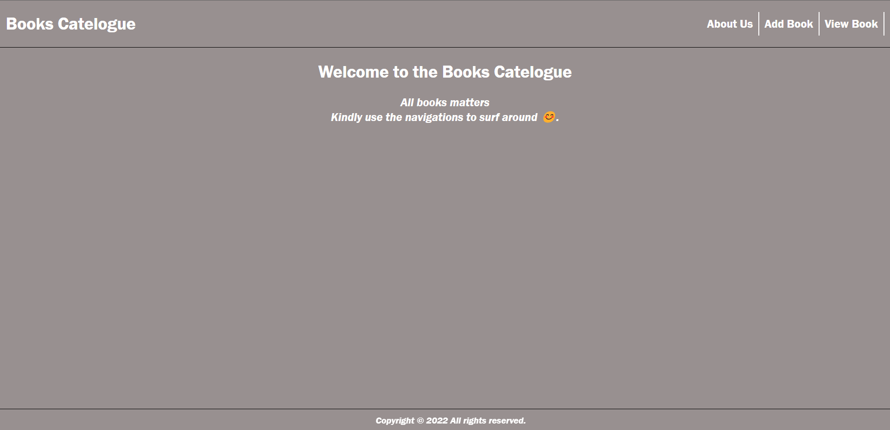

# A Books Catelogue
> Users with the link can go and add, view and delete books details according to users browsers cookies. By adding the Book name and Author Name.

## Home Page

## Built With 
HTML   CSS   JavaScript

## Live Demo

[Live Demo link](https://yinktech.github.io/books-Catelogue/)

## Authors

👤 **Author 1**

- GitHub: [@YinkTech](https://github.com/yinktech)
- Twitter: [@YinkTech](https://twitter.com/yinktech)
- LinkedIn: [Ayeni Olayinka](https://www.linkedin.com/in/ayeni-olayinka-726181134/)

👤 **Author 2**

- GitHub: [@shadrxcc](https://github.com/shadrxcc)
- Twitter: [@shadrxcc](https://twitter.com/shadrxcc)
- LinkedIn: [Shadrach Akaade](https://www.linkedin.com/in/shadrach-akaade-24a375189/)

## 🤝 Contributing
Contributions, issues, and feature requests are welcome!

Feel free to check the [issues page](https://github.com/YinkTech/books-Catelogue/issues).

## Show your support

Give a ⭐️ if you like this project!